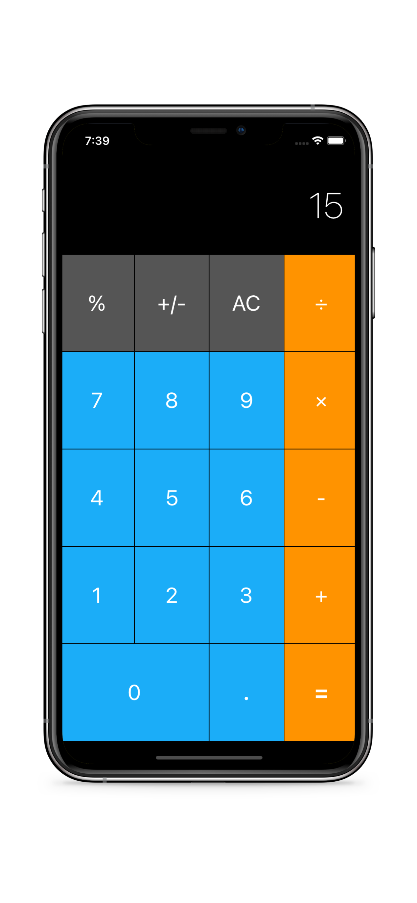
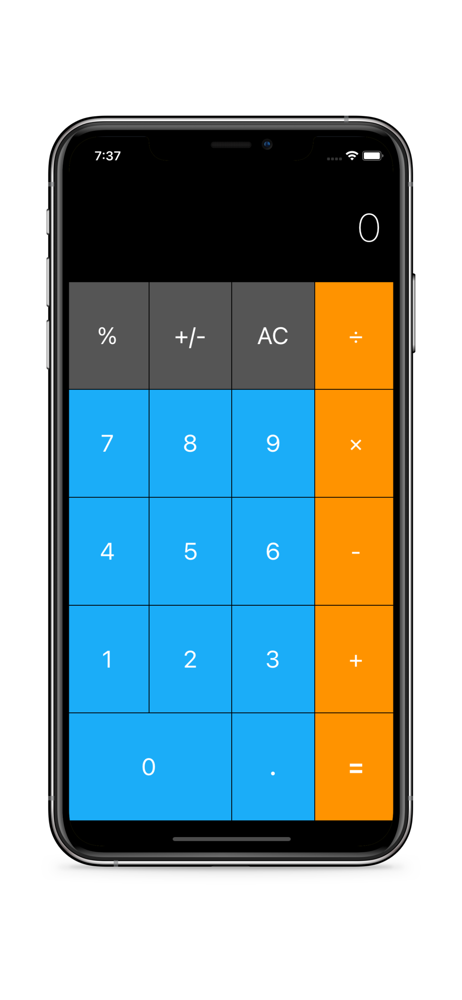

# Calculator App

IOS Calculator is a an IOS App that you are able to input numbers and add, multiply, divide, subtract and then get the output displayed

## Usage

1. Input your first number
1. Input the mode of operation (multiplication, addition, subtraction, division)
1. Press the Equal symbol to get the answer (=)

## Contributing
Pull requests are welcome. For any changes, please open an issue first to discuss what you would like to change.
